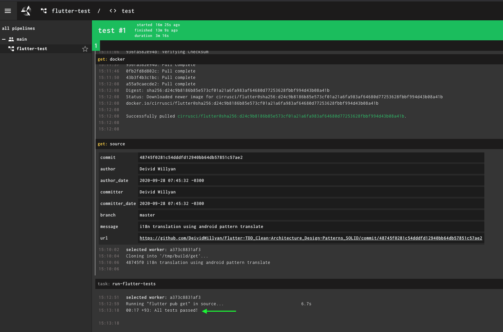

```
curl -O https://concourse-ci.org/docker-compose.yml
brew uninstall docker
docker-compose up -d
mv ~/Downloads/fly /usr/local/bin
chmod +x /usr/local/bin/fly
fly -t local login -c http://localhost:8080 -u test -p test
fly -t local sp -c pipeline.yml -p flutter-test
fly -t local up -p flutter-test
```

